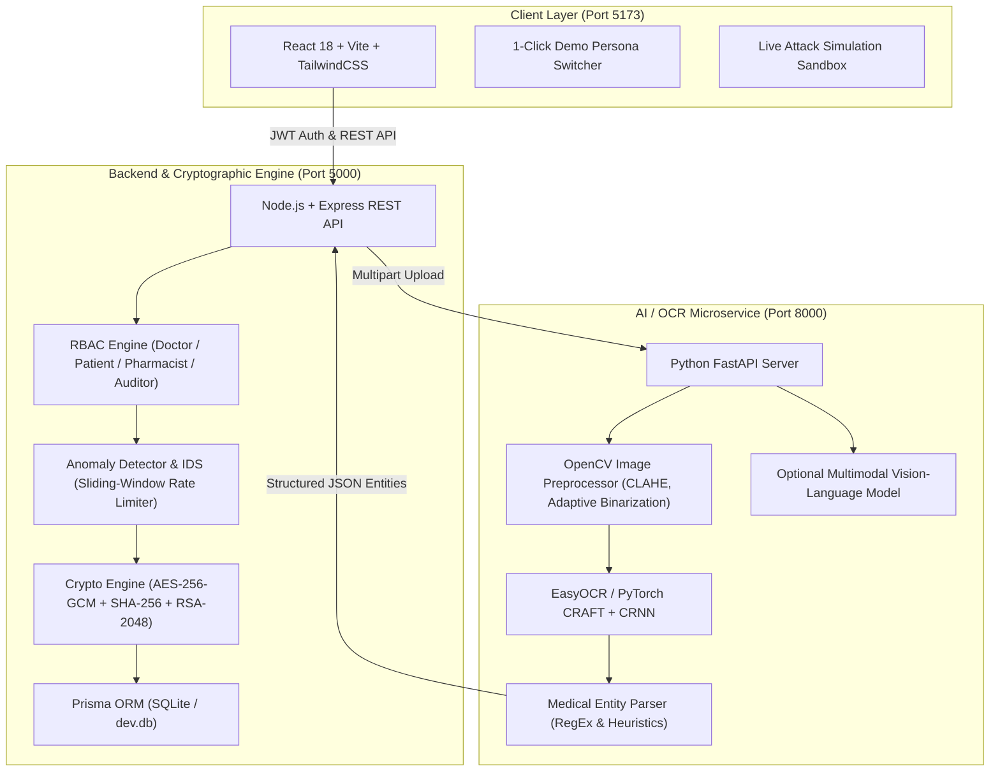

# 🔒 Zero-Knowledge Medical Prescription Vault

[](LICENSE)
[](frontend/)
[](backend/)
[](ai_service/)
[](#-cryptographic-specifications)
[](#-intrusion-detection--attack-defenses)

An enterprise-grade, privacy-preserving, tamper-evident e-prescription management ecosystem engineered for modern healthcare security. It integrates **Multimodal AI / OCR Entity Extraction**, **Role-Based Access Control (RBAC)**, **Zero-Knowledge Selective Disclosure**, **Authenticated Encryption at Rest (AES-256-GCM)**, **Non-Repudiation Digital Signatures (RSA-2048)**, and an active **Intrusion Detection System (IDS)**.

---

## 📑 Table of Contents

- [The Healthcare Privacy Problem](#-the-healthcare-privacy-problem)
- [System Architecture](#-system-architecture)
- [Key Security Innovations](#-key-security-innovations)
- [Cryptographic Specifications](#-cryptographic-specifications)
- [Intrusion Detection & Attack Defenses](#-intrusion-detection--attack-defenses)
- [Multimodal AI & OCR Pipeline](#-multimodal-ai--ocr-pipeline)
- [Technology Stack](#-technology-stack)
- [Project Directory Structure](#-project-directory-structure)
- [Quick Start Guide](#-quick-start-guide)
- [Demo User Personas](#-demo-user-personas)
- [Live Demonstration & Evaluation Script](#-live-demonstration--evaluation-script)
- [REST API Reference](#-rest-api-reference)
- [Viva & Technical Evaluation Q&A](#-viva--technical-evaluation-qa)

---

## 🚨 The Healthcare Privacy Problem

In traditional healthcare IT and pharmacy workflows:
1. **Unnecessary Information Leakage:** To dispense an antibiotic or pain reliever, a pharmacist is typically handed a clinical sheet showing the patient's entire medical record — including highly stigmatized or sensitive diagnoses (e.g., oncology, psychiatric therapy, HIV status, substance disorder history). Pharmacists need to verify *what medication to dispense* and *that an authorized doctor prescribed it*, not the patient's private diagnosis.
2. **Opioid Shopping & Prescription Forgery:** Paper and basic digital prescriptions are vulnerable to double-filling across multiple pharmacies, altered dosages, and forged physician stamps.
3. **Internal Database Tampering:** Compromised hospital database admins or rogue insiders can silently alter medical records or dosage figures without leaving an immutable cryptographic trail.

### 🛡️ Our Solution: Zero-Knowledge Selective Disclosure Vault
By decoupling sensitive clinical fields into cryptographically isolated **AES-256-GCM ciphertext blobs** and tying them to an asymmetric **RSA-2048 Doctor Signature** over a **canonical SHA-256 hash**, the vault enforces strict mathematical boundaries:
- **Pharmacists** verify the doctor's authenticity and view medications while confidential diagnoses remain cryptographically redacted.
- **Patients** decrypt and review their complete health vault.
- **Doctors** seal records with verifiable non-repudiation.
- **SecOps Auditors** monitor automated replay guards and cryptographic tamper alarms in real time.

---

## 🏗️ System Architecture



---

## 🔐 Key Security Innovations

### 1. Zero-Knowledge Selective Disclosure
* **Isolated Ciphertext Blobs:** When a doctor issues a prescription, the clinical diagnosis and the medication list are encrypted into distinct, independent AES-256-GCM ciphertext payloads.
* **Role-Adaptive Decryption:**
  * **Doctor & Patient:** Granted full decryption keys; receives diagnosis, clinical notes, and medication regimens.
  * **Pharmacist:** The backend withholds the diagnosis decryption key, automatically replacing the field with:  
    `[REDACTED: Protected by Zero-Knowledge Selective Disclosure]`.  
    The pharmacist receives only the authorized medication schedules and cryptographic validity proofs.

### 2. Tamper-Evident Integrity Fingerprinting (SHA-256)
* Before writing to the database, the system generates a deterministic, alphabetically sorted canonical representation of the prescription.
* A **SHA-256 digest** is calculated over this payload.
* Whenever a prescription is retrieved, the engine recalculates the live digest on the fly. If even a single byte or dosage number has been altered, the system flags a **TAMPER DETECTED** alert and blocks fulfillment.

### 3. Non-Repudiation Physician Signatures (RSA-2048)
* Upon account creation, each Doctor receives a dedicated **2048-bit RSA keypair**.
* The Doctor signs the canonical SHA-256 hash using their **RSA private key**.
* Pharmacists and patients verify the signature using the Doctor's public key. This mathematically guarantees that no administrator or third party forged the prescription.

### 4. Double-Fill & Replay Attack Defense
* Controlled substances (e.g., opioids) are protected by an immutable transactional state machine:  
  `ISSUED` ➔ `DISPENSED`.
* Any repeat attempt to fulfill a prescription triggers an immediate **`DOUBLE_FILL_ATTACK`** critical security alert in the SecOps console and rejects the transaction with HTTP 409 Conflict.

---

## 🔬 Cryptographic Specifications

| Component | Standard / Primitive | Parameters | Security Guarantee |
| :--- | :--- | :--- | :--- |
| **Data Confidentiality** | AES-GCM | 256-bit Key, 12-byte IV (NIST SP 800-38D) | Confidentiality at rest |
| **Data Authenticity** | GCM Auth Tag | 128-bit Authentication Tag | Prevents ciphertext manipulation |
| **Integrity Fingerprint** | SHA-256 | 256-bit Digest, Canonical JSON | Tamper detection across all fields |
| **Digital Signatures** | RSA-PSS / PKCS#1 | 2048-bit Asymmetric Keys | Non-repudiation & physician authenticity |
| **Password Hashing** | bcrypt | Salt Rounds = 10 | Protection against rainbow table attacks |
| **Session Authentication** | JWT (JSON Web Token) | HMAC-SHA256, 24-Hour Expiry | Role-validated stateless authorization |

---

## 🚨 Intrusion Detection & Attack Defenses

The system includes an active **SecOps Command Center** with built-in attack simulation endpoints to demonstrate resilience:

```text
[ Incoming Request ]
         │
         ├──► 1. Rate Limiter: >20 queries/10s? ──────────► [ ALERT: RATE_LIMIT_BURST ]
         │
         ├──► 2. Dispense Status: Already DISPENSED? ─────► [ ALERT: DOUBLE_FILL_ATTACK ]
         │
         ├──► 3. Hash Verification: SHA256(Record) == DB? ─► [ ALERT: TAMPER_DETECTED ]
         │
         └──► 4. Clean Request ──────────────────────────► Proceed to Controller
```

- **Double-Fill Replay Defense:** Blocks duplicate opioid/drug claims across pharmacies.
- **Cryptographic Tamper Alarms:** Instantly highlights record corruption or SQL injection alterations.
- **Rapid Request Anomaly Detection:** Identifies scraping bots attempting to enumerate patient prescription IDs.

---

## 🤖 Multimodal AI & OCR Pipeline

The Python microservice on port 8000 provides high-accuracy text extraction from handwritten or scanned prescription slips:

```text
Uploaded Image Slip (PNG / JPEG)
         │
         ▼
[ OpenCV Image Enhancement ]
  ├── Grayscale conversion
  ├── CLAHE (Contrast Limited Adaptive Histogram Equalization)
  ├── Bilateral filtering (noise reduction preserving edges)
  └── Adaptive Gaussian Thresholding (Binarization)
         │
         ▼
[ Deep Learning OCR / VLM Engine ]
  ├── Primary: Gemini 1.5 Flash Vision (if GEMINI_API_KEY set)
  └── Fallback: EasyOCR (PyTorch CRAFT Detector + CRNN Recognizer)
         │
         ▼
[ Medical Entity Parser ]
  ├── Doctor Name & License Matching
  ├── Clinic / Hospital Affiliation
  ├── Patient Name & Date Parsing
  ├── Confidential Diagnosis Detection
  └── Medication Extraction (Drug name, Strength in mg/ml, Dosage: 1-0-1, Frequency)
```

---

## 💻 Technology Stack

### Frontend Application
- **React 18** (Modern functional components & hooks)
- **Vite 5** (Blazing-fast build tool & HMR)
- **Tailwind CSS** (Custom clinical/cybersecurity theme)
- **Lucide React** (Security and medical iconography)
- **Axios** (JWT-authenticated REST communication)

### Backend Engine & Vault
- **Node.js 20+** & **Express 4**
- **Prisma ORM 5** (Type-safe schema management)
- **SQLite** (`dev.db` for zero-configuration local evaluation)
- **Native Node.js `crypto`** (Hardware-accelerated AES-GCM, SHA-256, RSA)
- **Multer** (In-memory streaming image uploads)

### AI Microservice
- **Python 3.10+** & **FastAPI**
- **Uvicorn** (ASGI asynchronous web server)
- **OpenCV (`opencv-python-headless`)** & **NumPy**
- **EasyOCR** & **Pillow**

---

## 📁 Project Directory Structure

```text
zk-medical-prescription-vault/
├── ai_service/                      # Python AI & OCR Microservice (:8000)
│   ├── main.py                      # FastAPI routes & CORS setup
│   ├── ocr_engine.py                # EasyOCR deep learning text extraction
│   ├── preprocessor.py              # OpenCV contrast & binarization pipeline
│   ├── parser.py                    # Medical entity extraction engine
│   ├── vlm_engine.py                # Optional Gemini Vision model integration
│   └── requirements.txt             # Python dependencies
│
├── backend/                         # Node.js Cryptographic Backend (:5000)
│   ├── prisma/
│   │   ├── schema.prisma            # Database models & relationships
│   │   └── dev.db                   # SQLite database file
│   ├── src/
│   │   ├── config/                  # Database connections & environment
│   │   ├── controllers/             # Auth, Prescription, and Security controllers
│   │   ├── middleware/              # Auth, RBAC, and IDS Anomaly Detector
│   │   ├── routes/                  # Express API route declarations
│   │   ├── services/                # AES-256-GCM, SHA-256, and RSA CryptoService
│   │   └── server.js                # Server entry point
│   ├── .env                         # Backend environment variables
│   ├── .env.example                 # Environment configuration template
│   └── package.json
│
├── frontend/                        # React Vite Application (:5173)
│   ├── src/
│   │   ├── components/              # UI components (Navbar, Modals, Badges)
│   │   ├── pages/                   # Doctor, Patient, Pharmacist, Auditor views
│   │   ├── services/                # Axios API clients
│   │   ├── App.jsx                  # Main routing & state controller
│   │   └── index.css                # Tailwind CSS imports
│   ├── vite.config.js
│   ├── tailwind.config.js
│   └── package.json
│
├── DEMO_STEPS.md                    # Detailed examiner presentation script
├── README.md                        # Master project documentation
└── run_all.ps1                      # 1-Click Windows PowerShell launcher
```

---

## ⚡ Quick Start Guide

### Prerequisites
- **Node.js** v18+ and **npm** v9+
- **Python** 3.10+ with `pip`
- **Windows PowerShell** (or bash on Linux/macOS)

---

### Option A: 1-Click Launch (Recommended)

From the project root (`zk-medical-prescription-vault`), run:

```powershell
.\run_all.ps1
```

> **Note:** If PowerShell restricts script execution, run:  
> `powershell -ExecutionPolicy Bypass -File .\run_all.ps1`

This will automatically spawn three terminal windows running:
1. **Frontend:** [http://localhost:5173](http://localhost:5173)
2. **Backend API:** [http://localhost:5000](http://localhost:5000)
3. **AI Service:** [http://localhost:8000/docs](http://localhost:8000/docs)

---

### Option B: Manual Setup & Launch

#### 1. Start Python AI Microservice (Port 8000)
```bash
cd ai_service
pip install -r requirements.txt
python -m uvicorn main:app --host 127.0.0.1 --port 8000 --reload
```

#### 2. Start Backend Engine (Port 5000)
```bash
cd backend
cp .env.example .env
npm install
npx prisma db push
npm run dev
```

#### 3. Start React Frontend (Port 5173)
```bash
cd frontend
npm install
npm run dev
```

Open [http://localhost:5173](http://localhost:5173) in your browser.

---

## 👥 Demo User Personas

The login page includes **1-Click Quick Login Cards** for seamless demonstrations:

| Persona | Role | Email | Password | Primary Demonstration |
| :--- | :--- | :--- | :--- | :--- |
| **Dr. Sarah Jenkins** | `DOCTOR` | `doctor@hospital.org` | `password123` | Upload slip, AI entity extraction, RSA digital signature signing |
| **Aarav Patel** | `PATIENT` | `patient@vault.org` | `password123` | Inspect full personal health records, copy Pharmacy Dispense ID |
| **Liam Vance, R.Ph** | `PHARMACIST` | `pharmacist@rxcare.org` | `password123` | Lookup ID, verify doctor signature, view meds only (**Diagnosis redacted**) |
| **Elena Rostova** | `AUDITOR` | `auditor@cybersecurity.org` | `password123` | Monitor IDS anomalies, run live attack simulations |

---

## 🎬 Live Demonstration & Evaluation Script

Follow these 4 scenarios to demonstrate the core features:

### Scenario 1: Issue a Tamper-Proof Prescription (Doctor Role)
1. Log in as **Doctor** (`doctor@hospital.org`).
2. Upload a prescription slip image and click **"Extract Medical Entities via AI"**.
   - *Evaluator note:* Point out the OpenCV contrast enhancement and structured JSON output (doctor, diagnosis, medications, dosages).
3. Review the extracted fields and click **"Sign, Hash (SHA-256) & Seal to Vault"**.
   - *Evaluator note:* The system computes the canonical SHA-256 hash, signs it with the doctor's RSA-2048 private key, and encrypts diagnosis and medications as independent AES-256-GCM ciphertexts.
4. Copy the generated **Prescription ID**.

### Scenario 2: Patient Vault Access (Privacy at Rest)
1. Switch to **Patient** (`patient@vault.org`).
2. Click **"View & Decrypt Full eRx"**.
3. Notice that as the patient, you have access to the **Confidential Diagnosis** and the full medication list.
4. Copy the **Pharmacy Dispense ID**.

### Scenario 3: Zero-Knowledge Selective Disclosure (Pharmacist Role)
1. Switch to **Pharmacist** (`pharmacist@rxcare.org`).
2. Paste the Prescription ID into the search bar and click **"Verify & Inspect"**.
3. **Key Demonstration Point:**
   - The **Confidential Diagnosis** displays:  
     `[REDACTED: Protected by Zero-Knowledge Selective Disclosure]`.
   - The yellow privacy banner confirms diagnosis withholding.
   - The badges display **SHA-256 Integrity: Verified** and **Doctor RSA Signature: Valid**.
4. Click **"Fulfill & Dispense eRx"**. Status transitions to `DISPENSED`.

### Scenario 4: Attack Simulation Sandbox
1. **Replay / Double-Fill Attack:** In Pharmacist view, attempt to click "Fulfill & Dispense" again on the same prescription. The system immediately blocks the request and triggers a **CRITICAL DOUBLE_FILL_ATTACK** alert.
2. **Cryptographic Tamper Attack:** Click **"Simulate Tamper Attack"**. The backend corrupts the stored hash in the database. When refreshed, the integrity badge turns **RED** with **"TAMPER DETECTED! HASH MISMATCH"** and dispensing is disabled.
3. **SecOps Monitoring Console:** Switch to **Auditor** (`auditor@cybersecurity.org`) to view live anomaly alerts with timestamps, severity levels, and IP addresses.

---

## 📡 REST API Reference

### Authentication Endpoints
- `POST /api/auth/register` — Register a new user (`PATIENT`, `DOCTOR`, `PHARMACIST`, `AUDITOR`).
- `POST /api/auth/login` — Authenticate and receive a 24-hour JWT token.
- `GET /api/auth/me` — Retrieve the current authenticated user profile.
- `POST /api/auth/seed-demo` — Reset and seed the default demo accounts.

### Prescription Management Endpoints
- `POST /api/prescriptions/upload-ocr` — Upload slip image to Python AI service (Requires `DOCTOR` or `PATIENT`).
- `POST /api/prescriptions/issue` — Canonical hash, RSA sign, and AES-256-GCM seal prescription (`DOCTOR`).
- `GET /api/prescriptions` — List all prescriptions accessible to the authenticated user.
- `GET /api/prescriptions/:id` — Retrieve prescription with role-based selective disclosure redaction.
- `POST /api/prescriptions/:id/dispense` — Mark prescription as `DISPENSED` (`PHARMACIST`).

### Security & Anomaly Detection Endpoints
- `GET /api/security/alerts` — Fetch real-time IDS security alerts (`AUDITOR`).
- `GET /api/security/audit-logs` — Retrieve cryptographic access audit logs (`AUDITOR`).
- `POST /api/security/simulate/double-fill` — Trigger simulated double-fill replay attack.
- `POST /api/security/simulate/tamper-bitflip` — Trigger simulated database bit-flip tampering.
- `POST /api/security/simulate/bot-burst` — Trigger simulated automated rate-limit burst.

### AI Microservice Endpoints (`:8000`)
- `GET /health` — Check status of EasyOCR and Vision-Language models.
- `POST /api/ocr/extract` — Upload an image file for OpenCV preprocessing and entity extraction.

---

## 💡 Viva & Technical Evaluation Q&A

**Q1: Why is this called Zero-Knowledge if you use AES-256-GCM?**  
*Answer:* In cryptographic protocol design, "Zero-Knowledge" describes the privacy guarantee provided to the verifier: the pharmacist can mathematically verify the authenticity and validity of the prescription without learning the underlying sensitive diagnosis. We achieve this through **Selective Disclosure Architecture**, where distinct data fields are encrypted in separate ciphertext containers.

**Q2: What is the purpose of GCM mode over standard CBC mode in AES?**  
*Answer:* Standard AES-CBC provides confidentiality but is vulnerable to padding oracle attacks and bit-flipping if unauthenticated. AES-GCM (Galois/Counter Mode) provides **Authenticated Encryption with Associated Data (AEAD)**. It produces an authentication tag alongside the ciphertext; any unauthorized modification to the ciphertext is detected during decryption before plaintext is returned.

**Q3: How does the system prevent a compromised database administrator from forging prescriptions?**  
*Answer:* The doctor signs the canonical SHA-256 digest with an **asymmetric RSA-2048 private key** stored exclusively on the doctor's side. Even an attacker with complete root access to the SQLite/PostgreSQL database cannot generate a valid digital signature for altered data without the doctor's private key.

**Q4: How does the system defend against Replay / Double-Fill attacks?**  
*Answer:* Prescriptions follow a strictly enforced state machine (`ISSUED` ➔ `DISPENSED`). When a pharmacist fulfills an order, the status transition is atomically committed. Any subsequent dispense attempt is intercepted by the anomaly detection middleware, returning HTTP 409 and raising a high-priority `DOUBLE_FILL_ATTACK` security event.

**Q5: Why use a Python microservice alongside Node.js?**  
*Answer:* Python provides industry-standard computer vision and deep learning ecosystems (OpenCV, PyTorch, EasyOCR). Running text extraction in a dedicated microservice keeps CPU-intensive OCR workloads decoupled from the Node.js I/O event loop, preserving low-latency cryptographic operations.

---

## 📄 License

This project is licensed under the MIT License — see the [LICENSE](LICENSE) file for details.
